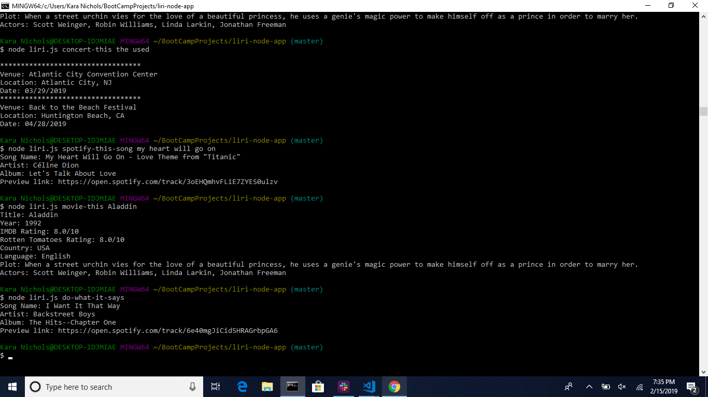

# liri-node-app

This command line application written with Node.js takes in one of the four preset arguments or commands to search for more information about a specific term. Three different APIs and one txt file are used to faciliate the search. All results also log to a separate txt file.

### Valid Commands
* concert-this _(search Bands in Town API for an artist's next show(s))_
* spotify-this-song _(search Spotify for more info about a song)_
* movie-this _(search OMDB for more info about a movie)_
* do-what-it-says _(search info from file random.txt)_

### Node.js Packages Used
* spotify
* axios
* fs
* dotenv
* moment

### APIs Used
* Bands in Town
* Spotify
* OMDB